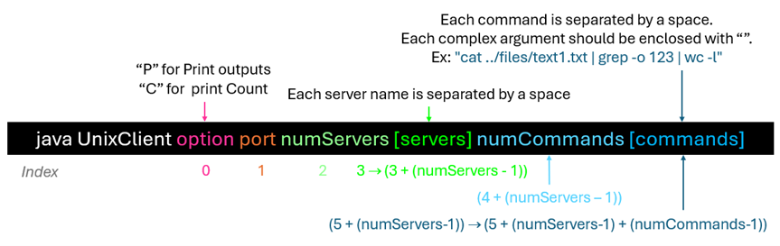
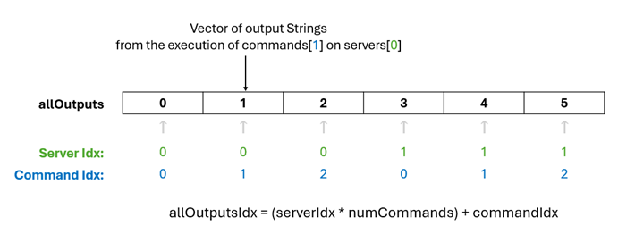
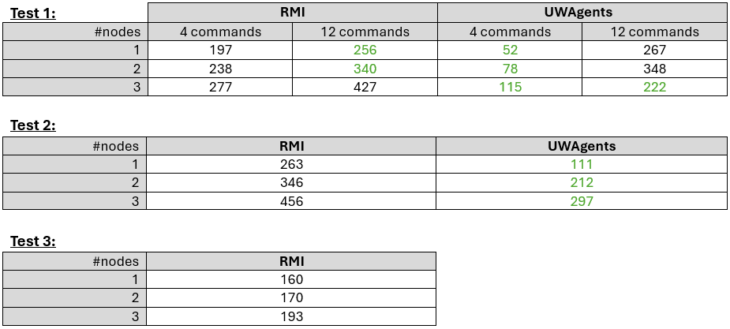

# Files
UWAgent.jar             A jar file including all UWAgent daemon's bytecode
UWAgentUserManual.pdf   The latest user manual

AnAgent.java            A sample Java program
MyAgent.java            The key answer for Lab3
WhoAgent.java           The key answer for HW3

compile.sh              A shell script to compile an agent (ex. compile.sh AnAgent.java) 
runUWPlace.sh           A shell script to run a UWAgent daemon (ex. runUWPlace.sh 12345)
runAgent.sh             A shell script to inject an agent (ex. runAgent.sh 12345 AnAgent)
runWhoAgent.sh          A shell script to inject WhoAgent (ex. runWhoAgent.sh 12345)

# Algorithms
Both programs:
- Are meant to execute Unix commands on multiple remote servers.
- Use print option:
  - P: Print mode. Output all results of command executions.
  - C: Count mode. Output only the number of lines from the command executions.
- Record the execution time, and display it at the end. 

## UnixClient
UnixClient is an RMI-based client program. The client behaves as the central control: 
it coordinates interactions with servers, sequentially executing commands to each server and retrieving their output. 

### 1.	Argument Parsing and Initialization:
The main method parses a minimum of 6 of the following arguments:

If less than 6 parameters are given, or the input is invalid, and/or parsing fails, the program exits.

Otherwise UnixClient uses them to initialize the following, then proceeds.
- **printCommandOutputs**: Boolean based on option. If “P”, set to true.
  - Option = “P”: True. Print the command outputs after execution.
  - Option = “C”: False. Count the number of output lines and output the count instead.

- **port**: Int representing the port hosting the service.
- **servers**: String array of server names to connect to and execute commands on.
- **commands**: String array of commands to run on each server. 

The **allOutputs** String vector is initialized as empty, at the size of one Vector for each command for each server.

Each cell is meant to store a Vector of string outputs for when the corresponding command is executed on the corresponding server.

“Output” Naming Convention: 
- **allOutputs** is an Array of Vectors of Strings
  - “**outputs**” is a vector of strings
    (1 vector corresponds to the outputs of a single command for a specific server)
      - “**output**” is a string representing one line from the outputs.

Finally, **outputCount** is an integer initialized at 0, meant to track the number of lines of output from executions.

### 2.	Command execution: Server Coordination
The program records the starting time using Date (it will be compared with the end date for the duration). 
Then, for each server, it:
1.	Prints the server name only if **printCommandOutputs** was set to true. 
2.	Connects to the server:
   - Resolves the hostname to an IP with InetAddress.
   - Retrieves the RMI stub for the server with Naming.lookup.
  If the connection fails, the program outputs an error message, and continues to the next server

2. 	For each command, it:
  a.	Sends each command in the commands list, which calls the server’s execute(command) method.
      The server code is in the provided UnixServer.java program.
  b.	Retrieves the outputs vector and stores it in its corresponding cell of the **allOutputs** vector, 
      And updates the **outputCount** based on the outputs vector size.
  c.	Prints each line of output from outputs, IF in print mode.

Then the program displays the total count of output lines, IF in count mode.
Finally, it ends by recording the end time and displaying the execution duration. 

## UnixAgent
UnixAgent Mobile-agent-based; the agent migrates to servers, executes commands locally, and 
carries results back to the origin. Unlike UnixClient, there is no central control or client-server interaction overhead, 
since agents are autonomous; the agent decides when and where to migrate.

### 1. Argument Parsing and Initization
UnixAgent accepts and processes arguments similarly to UnixClient, except 
it doesn’t need the port and thus has a minimum of 5 parameters. 

### 2. Command execution: Agent Deployment
UnixAgent also begins by recording the starting time. 
Then, it starts communication execution by determining the injection point **orgPlace** (using the local host’s address) 
and begins the execution loop by hopping to the first stored server and invoking unix():
1.	Executes each command in the commands list.
  a.	Runs the command locally with Runtime.
  b.	Stores the execution output into a Vector<String>, in allOutputs.
  c.	If there are more servers: Hop to the next server and call unix() again.

Once done executing on all servers, return to the original host **orgPlace** and call results.

### 3. Display
IF in print mode, results() iterates over all servers and commands to display outputs stored in allOutputs. 
Otherwise, IF in count mode, it just prints the total count of output lines. 

# UnixClient vs UnixAgent
## Programmability 
Lines of Code (**LOC**) include whitespace, but exclude import statements and comments.
**UnixClient has ~135 LOC**, while **UnixAgent has ~160 LOC**. 
The UnixAgent code is slightly larger due to managing state across migrations, 
including the execution logic (unix), and using an additional loop for printing (results). 
It's slightly higher LOC also reflects the additional complexity.

**UnixClient has a linear and static control flow**; The client sequentially initiates actions, 
communicates with servers and processes responses predictably. 
The client is in charge of handling state, and the server is in charge of the execution logic. 

On the other hand, agent-based programming had a steeper learning curve since 
**UnixAgent has a dynamic control flow**. Agents hop between servers, and require state management 
and checking (for example, return to orgPlace once done with all servers). 
Agents are responsible for their state management and execution logic. 

## Perfromance
Tests:
- **Test 1:** Execute multiple commands (4 or 12 commands) at remote servers.
  This intends to see how RMI client/servers VS. UWAgent would run longer with more commands.
- **Test 2:** Execute a grep at remote servers. This test finds all occurrences of a given string (i.e., “123”)
    in text1.txt (with 10GB) at each remote server and prints out only the total number of occurrences at the client side.
- **Test 3 (RMI only):** Download text1.txt (with 10GB) from each remote server, locally find all occurrences of a given string
  (i.e., “123”), and print out the total number of occurrences at the client side. 

**Note: Results are the fastest among 5 executions.**

_Note that performance may be impacted by variant testing times/locations, 
as there wasn’t an opportunity to run all tests together with the still-ongoing power outages._

UnixAgent has an advantage with:
- A **small number of commands per node**. By carrying the execution logic to the server and performing commands locally,
  agents lower the network overhead of repeated client-server communication.
- **More nodes** (see Test 2), as it scales better due to reduced network roundtrips. Agents hoping to nodes and
  locally executing commands is more efficient than multiple RMI calls.
-	During **unreliable connectivity**. This is because agents are autonomous and don’t rely on an ongoing network connection.

